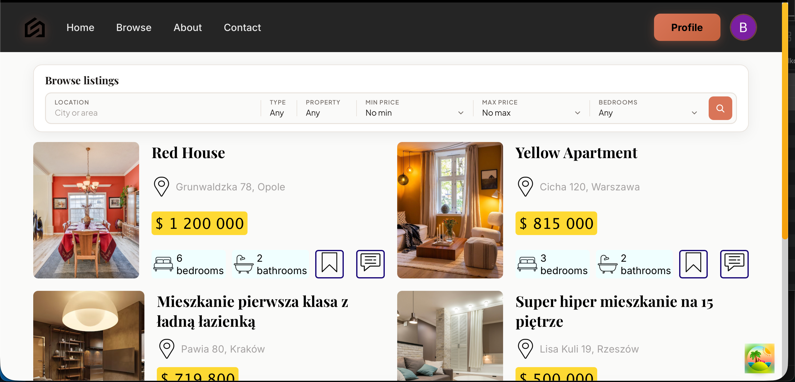
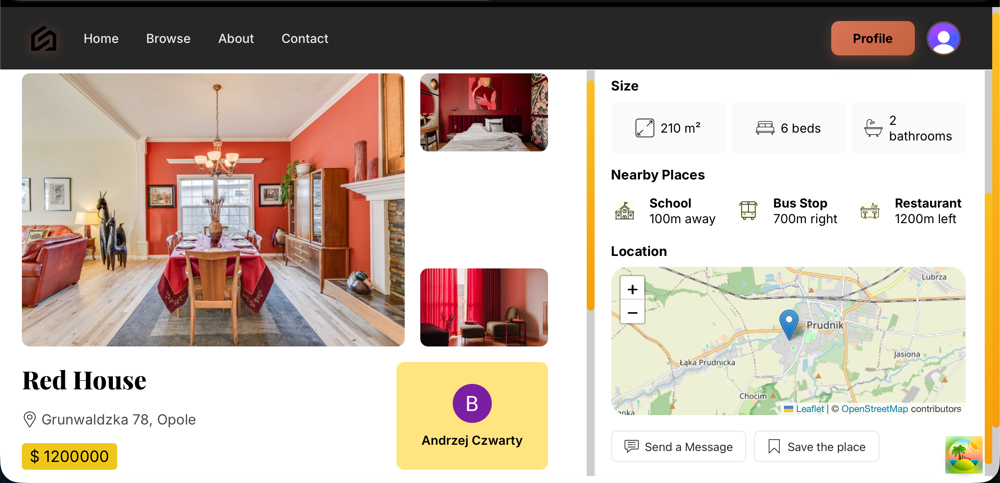
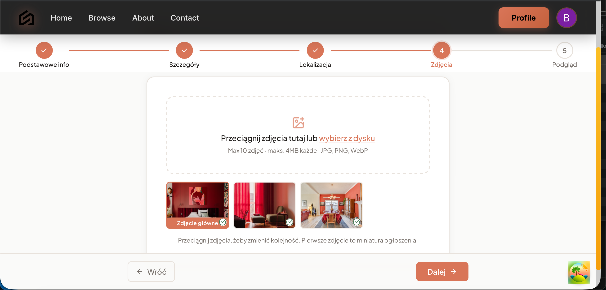
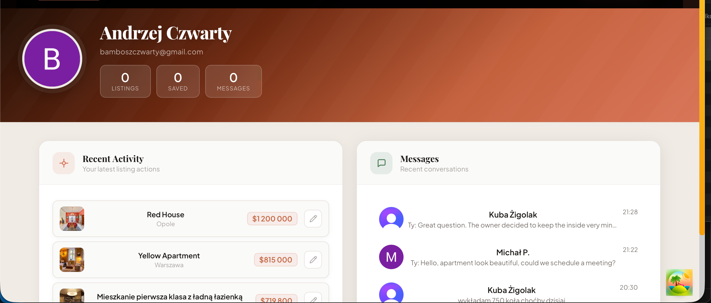
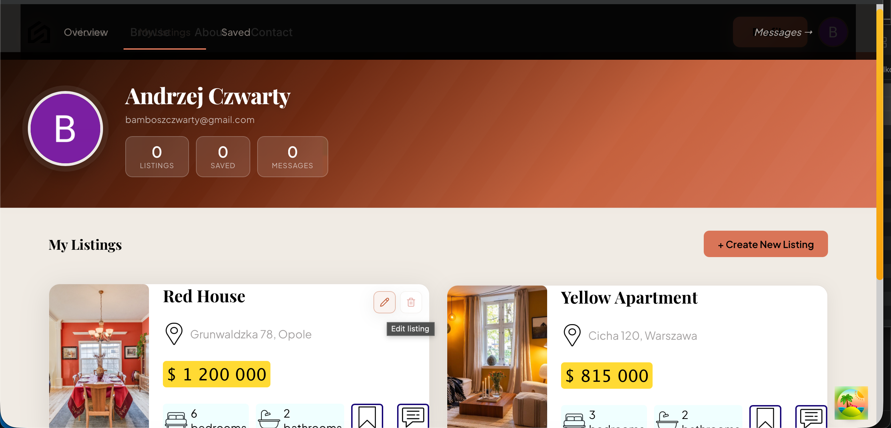
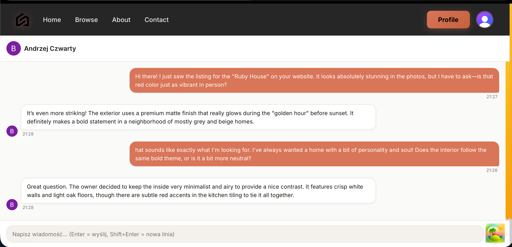

# Real Estate Marketplace

A full-stack real estate marketplace where users can browse and filter property listings, contact sellers via built-in chat, save favourites, and publish their own listings through a multi-step wizard — all secured with JWT-based authentication.


---

## Table of Contents

- [Tech Stack](#tech-stack)
- [Architecture & Data Flow](#architecture--data-flow)
- [Features](#features)
- [Screenshots](#screenshots)
- [Project Structure](#project-structure)
- [API Endpoints](#api-endpoints)
- [Setup](#setup)
- [License](#license)

---

## Tech Stack

### Core

| Layer | Technology |
|---|---|
| Frontend | React 18 + TypeScript, Vite, SCSS (BEM) |
| Backend | Node.js, Express, TypeScript |
| Database | PostgreSQL via [Neon](https://neon.tech) (serverless) |
| ORM | Drizzle Kit — schema-first, type-safe queries |

### Key Libraries

| Library | Purpose |
|---|---|
| [Clerk](https://clerk.com) | Full authentication layer — sessions, JWT tokens, OAuth, protected UI components. No custom auth logic. |
| [TanStack Query](https://tanstack.com/query) | Server state management — caching, background refetching, and optimistic updates for all API calls. |
| [Uploadthing](https://uploadthing.com) | File hosting for property photos and avatars — returns URLs stored in the DB, no binary data in Postgres. |
| [Zod](https://zod.dev) | Runtime schema validation on both frontend (forms) and backend (request bodies, query params). |
| [React Leaflet](https://react-leaflet.js.org) | Interactive map on listing detail pages with a custom marker + popup. |
| [React Hook Form](https://react-hook-form.com) | Form state for the multi-step listing wizard with per-step Zod schemas. |

---

## Architecture & Data Flow

### 1. Two-Layer Authentication

Every protected resource is guarded at two levels:

**Frontend — `ProtectedRoute`**
React Router wrapper using Clerk's `useAuth()`. If the user is not signed in, renders `<RedirectToSignIn />` before the page component even mounts. Wraps: `/profile/*`, `/listings/new`, `/listings/:id/edit`, `/messages/*`.

**Backend — `requireAuth` middleware**
Every sensitive route runs `getAuth(req)` from `@clerk/express`. If no valid session token is present, returns `401 Unauthorized` immediately. The `userId` extracted here is used for all database writes — the server never trusts a user-supplied ID in the body.

```
Browser request
  → ProtectedRoute checks Clerk session (frontend guard)
  → API call with Authorization: Bearer <JWT>
  → requireAuth extracts userId from token (backend guard)
  → Service layer uses userId for DB operations
```

### 2. Axios Interceptor — Automatic Token Attachment

`client/src/lib/apiClient.ts` — a configured axios instance used by every hook in the app:
- **Request interceptor**: fetches the current Clerk JWT and attaches it as `Authorization: Bearer <token>` before every outgoing request
- **Response interceptor**: catches `401` responses globally and logs them; Clerk handles token refresh automatically

This means no hook or component ever manually handles auth headers.

### 3. Service Layer

The backend follows a clean three-tier separation:

```
Route handler  →  Service  →  Drizzle ORM  →  Neon PostgreSQL
```

- **Routes** (`server/src/routes/`) — parse and validate the request, call a service method, return the response
- **Services** (`server/src/services/`) — contain all business logic: filtering, pagination, ownership checks, DB queries
- **Drizzle** — type-safe query builder; schema defined once in `db/schema.ts`, used across the entire backend

### 4. Zod Validators as a Separate Layer

All input validation lives in `server/src/validators/` — one file per resource (`listing.ts`, `conversation.ts`, `message.ts`). Routes call `.parse()` on incoming data before it reaches the service layer. Invalid input returns `400` with structured error details. The same Zod schemas are mirrored on the frontend for form validation, keeping client and server rules in sync.

### 5. TanStack Query Hooks

All server state is managed through custom hooks in `client/src/hooks/`:

| Hook | What it does |
|---|---|
| `useListings` | Paginated listing list with filters and sorting; cached per query key |
| `useListing` | Single listing detail; shared cache with list |
| `useFavorite` | Toggle with optimistic update — UI reflects change instantly, rolls back on error |
| `useConversations` | Conversation list for the messages page |
| `useMessages` | Polls `GET /api/conversations/:id/messages` every 4 seconds for real-time feel |
| `useUnreadCount` | Unread badge count in the navbar; refetches on window focus |

TanStack Query eliminates manual loading/error state, deduplicates concurrent requests, and keeps the UI consistent without prop drilling.

---

## Features

- **Homepage** — hero search bar with Rent/Buy toggle, latest listings section, value proposition, testimonials carousel
- **Browse listings** — filterable and sortable listing grid with city autocomplete and price/type/area filters
- **Single listing page** — image gallery with drag-and-drop reorder, interactive Leaflet map, favourite button (auth-gated), contact seller button
- **Listing wizard** *(main feature)* — multi-step form (`/listings/new`) split across 5 steps: Basic Info → Details → Location → Photos → Preview. Each step is validated independently with Zod + React Hook Form. Progress is auto-saved to `localStorage` so a page refresh never loses data. Uploadthing handles photo uploads with drag-and-drop and a 10-file limit. The listing is only published on the final Preview step.
- **Profile** — tabbed layout (`/profile/*`) with Overview, My Listings, Saved listings and Settings; avatar upload via Uploadthing
- **Messages** — two-column messenger (desktop) / full-screen chat (mobile); polling-based real-time updates; unread count badge in the navbar
- **Auth** — Clerk modals for sign-in/sign-up; no custom session logic; `ProtectedRoute` guards all private pages

---

## Screenshots

### Homepage


### Browse Listings


### Single Listing


### Listing Wizard


### Profile


### My Listings


### Messages


---

## Project Structure

```
rental-app/
├── client/                     # React + TypeScript frontend (Vite)
│   └── src/
│       ├── components/         # Reusable UI components (Navbar, cards, map, filters, auth wrappers)
│       ├── routes/             # Page-level components — one folder per route
│       ├── hooks/              # TanStack Query hooks — all server state lives here
│       ├── lib/                # apiClient.ts (axios instance with Clerk interceptor)
│       ├── styles/             # Global SCSS variables, mixins, and breakpoints
│       └── assets/             # Static images and icons
│
├── server/                     # Node.js + Express backend
│   └── src/
│       ├── routes/             # Express route handlers — thin layer, delegates to services
│       ├── services/           # Business logic — filtering, pagination, ownership checks
│       ├── middleware/         # requireAuth (Clerk JWT verification)
│       ├── validators/         # Zod schemas per resource — used in routes before service calls
│       ├── uploadthing/        # Uploadthing file router config (listing photos + avatars)
│       └── db/                 # Drizzle schema (schema.ts) and generated migrations
│
├── docs/images/                # Screenshots used in this README
├── docker-compose.yml          # Runs client + server together
└── .env.example                # Required environment variables (both client and server)
```

---

## API Endpoints

### Listings

| Method | Endpoint | Auth | Description |
|---|---|---|---|
| `GET` | `/api/listings` | — | List listings with filters (`city`, `type`, `minPrice`, `maxPrice`), sorting and pagination |
| `GET` | `/api/listings/:id` | — | Single listing detail with `isFavorited` flag |
| `GET` | `/api/listings/cities?q=` | — | City autocomplete (debounced on frontend) |
| `POST` | `/api/listings` | ✓ | Create a new listing |
| `PUT` | `/api/listings/:id` | ✓ | Update listing (owner only) |
| `DELETE` | `/api/listings/:id` | ✓ | Soft-delete listing (owner only) |

### Favourites

| Method | Endpoint | Auth | Description |
|---|---|---|---|
| `GET` | `/api/favorites` | ✓ | All favourites for the current user |
| `POST` | `/api/favorites/:listingId` | ✓ | Add to favourites |
| `DELETE` | `/api/favorites/:listingId` | ✓ | Remove from favourites |

### Conversations & Messages

| Method | Endpoint | Auth | Description |
|---|---|---|---|
| `POST` | `/api/conversations` | ✓ | Create or resume existing conversation for a listing |
| `GET` | `/api/conversations` | ✓ | All conversations for the current user |
| `GET` | `/api/conversations/unread-count` | ✓ | Unread message count for navbar badge |
| `GET` | `/api/conversations/:id/messages` | ✓ | Messages in a conversation (polled every 4s) |
| `POST` | `/api/conversations/:id/messages` | ✓ | Send a message |

---

## Setup

> **Required free accounts:** [Clerk](https://clerk.com), [Neon](https://neon.tech), [Uploadthing](https://uploadthing.com)

### Standard

```bash
git clone https://github.com/pjenkacz/rental-app.git
cd rental-app

# Backend
cd server && npm install
cp .env.example .env   # fill in your keys
npm run db:push        # push schema to Neon
npm run dev            # runs on localhost:3001

# Frontend (new terminal)
cd client && npm install
cp .env.example .env   # fill in VITE_CLERK_PUBLISHABLE_KEY
npm run dev            # runs on localhost:5173
```

### Docker

```bash
# Fill in both .env files first, then:
docker-compose up --build
```

Frontend → http://localhost:5173 · Backend → http://localhost:3001

> Run `npm run db:push` from the `server/` directory once before first use to create tables in Neon.

---

## License

MIT
